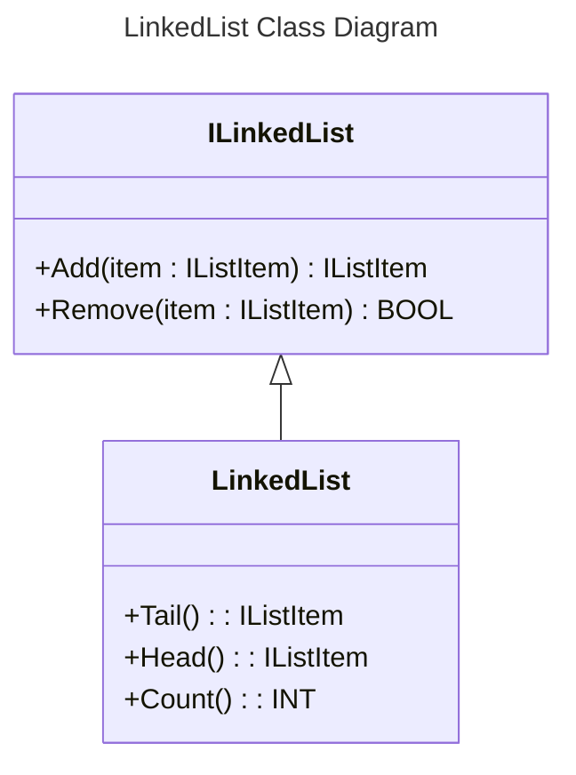

# Simatic.AX.Collections

This collection library contains some classes for list handling of types of IListItem. Unfortunately the ST implementation does not support any generic data types and also no dynamic memory allocation. Therefore this example library has much space for improvement and it is open for discussion with other users.

The actual implementation is based on a linked list item (IListItem) where you need to create for each item a instance (which also can be stored in an array)
The Advantage of the concept is, that you don't need to use arrays with fixed size and you can mix the types as long as they're of type IListItem.

> Important: By inserting, adding, writing some items NO copy of the object will be created. You need to manage the list items by yourself.

## Install this package

Enter:

```cli
apax add @simatic-ax/collections
```

## Namespace

```iec-st
Simatic.Ax.Collections;
```

> to install this package you need to login into the GitHub registry. You'll find more information [here](https://github.com/simatic-ax/.github/blob/main/docs/personalaccesstoken.md)

## Linked List

### Class LinkedList



Example:

```iec-st
USING AxUnit.Assert;

NAMESPACE Simatic.Ax.Collections

    // Example of a concrete customized ListItem
    CLASS MinMaxItem
        EXTENDS ListItem
        VAR PUBLIC
            Min : INT;
            Max : INT;
        END_VAR
    END_CLASS

    // Example of a concrete customized ListItem
    CLASS RangeItem
        EXTENDS ListItem
        VAR PUBLIC
            FromValue : INT;
            ToValue : INT;
        END_VAR
    END_CLASS

    {TestFixture}
    CLASS Example
        VAR PRIVATE
            _list : LinkedList;
            _i1 : MinMaxItem := (Min := 1, Max := 100);
            _i2 : MinMaxItem := (Min := 2, Max := 200);
            _i3 : RangeItem := (FromValue := 3, ToValue := 300); // declare a wrong, another list item which is not of type MinMaxItem
            _item : REF_TO MinMaxItem;
        END_VAR
        // Add 2 elements of MinMaxItem and one wrong element RangeItem to the list. 
        // By reading the tail, the assignment attempt (?=) fails, because RangeItem can not be converted to MinMaxItem

        {Test}
        METHOD PUBLIC Test_Add_3_Elements_To_Queue_And_Get_Values_from_first_item
            _list.Add(item := _i1); // add i1 to head
            _list.Add(item := _i2);
            _list.Add(item := _i3); // add _i3, a wrong IListItem to the list (Tail)
            _item ?= _list.Tail(); // assignment attempt (?=) --> It's NULL if not of type MinMaxItem
            Equal(_item <> NULL, TRUE);
            IF (_item <> NULL) THEN
                Equal(_item^.Min, 1);
                Equal(_item^.Max, 100);
            END_IF;
            _item ?= _list.Head(); // assignment attempt (?=) --> It's NULL if not of type MinMaxItem
            Equal(_item = NULL, TRUE);
            IF (_item <> NULL) THEN
                NotEqual(_item^.Min, 3);
                NotEqual(_item^.Max, 300);
            END_IF;
            Equal(expected := 3, actual := _list.Count());
        END_METHOD
    END_CLASS

END_NAMESPACE
```

### LinkedList.Add() : IListItem Method

Add a new object IListItem to the end of the list

|Parameter|Type|Description|
|-|-|-|
|Return Value   |IListItem |Reference to the inserted item  |
|item           |IListItem |Item to be inserted             |
|join           |BOOL      |Create a ring list. First and last element will be linked. It works only once with the latest item which is added.

```iec-st
METHOD PUBLIC FINAL Add : IListItem
    VAR_INPUT
        item : IListItem;
        join : BOOL := FALSE;
    END_VAR
END_METHOD
```

### LinkedList.Remove() : BOOL Method

Remove a IListItem from the list.

```iec-st
METHOD PUBLIC Remove : BOOL
    VAR_INPUT
        item : IListItem;
    END_VAR
END_METHOD
```

|Parameter|Type|Description|
|-|-|-|
|Return Value   |Bool       |Removing item was successful    |
|item           |IListItem  |Reference to item to be removed |

## Fifo

Represents a first-in, first-out (FIFO) collection of IListItem.

### Fifo.Enqueue(item : IListItem) : IListItem Method

```iec-st
METHOD Enqueue : IListItem
    VAR_INPUT
        item : IListItem;
    END_VAR
END_METHOD
```

|Parameter|Type|Description|
|-|-|-|
|Return Value   |IListItem |Reference to the enqueued item  |
|item           |IListItem |Item to be inserted             |

### Fifo.Dequeue() : IListItem Method

```iec-st
METHOD Dequeue : IListItem
END_METHOD
```

|Parameter|Type|Description|
|-|-|-|
|Return Value   | IListItem       | Return and remove the oldest element in the list  |

### Fifo.Count() INT

```iec-st
    METHOD PUBLIC Count : INT
    END_METHOD
```

|Parameter|Type|Description|
|-|-|-|
|Return Value   |INT        |Count of elements in the FIFO   |

## Stack

Represents a simple last-in-first-out (LIFO) collection of IListItem.

### Stack.Push(item : IListItem) : IListItem Method

```iec-st
METHOD Push : IListItem
    VAR_INPUT
        item : IListItem;
    END_VAR
END_METHOD
```

|Parameter|Type|Description|
|-|-|-|
|Return Value   |IListItem |Reference to the pushed item  |
|item           |IListItem |Item to be inserted             |

### Stack.Pop() : IListItem Method

```iec-st
METHOD Pop : IListItem
END_METHOD
```

|Parameter|Type|Description|
|-|-|-|
|Return Value   | IListItem       | Return and remove the newest element in the list  |

### Stack.Peek() : IListItem Method

```iec-st
METHOD Peek : IListItem
END_METHOD
```

|Parameter|Type|Description|
|-|-|-|
|Return Value   | IListItem       | Return the newest element in the list (without removing) |

### Stack.Count() : INT

```iec-st
    METHOD PUBLIC Count : INT
    END_METHOD
```

|Parameter|Type|Description|
|-|-|-|
|Return Value   |INT        |Count of elements in the LIFO   |

## Contribution

Thanks for your interest in contributing. Anybody is free to report bugs, unclear documentation, and other problems regarding this repository in the Issues section or, even better, is free to propose any changes to this repository using Merge Requests.

### Markdownlint-cli

This workspace will be checked by the [markdownlint-cli](https://github.com/igorshubovych/markdownlint-cli) (there is also documented ho to install the tool) tool in the CI workflow automatically.  
To avoid, that the CI workflow fails because of the markdown linter, you can check all markdown files locally by running the markdownlint with:

```sh
markdownlint **/*.md --fix
```

## License and Legal information

Please read the [Legal information](LICENSE.md)
